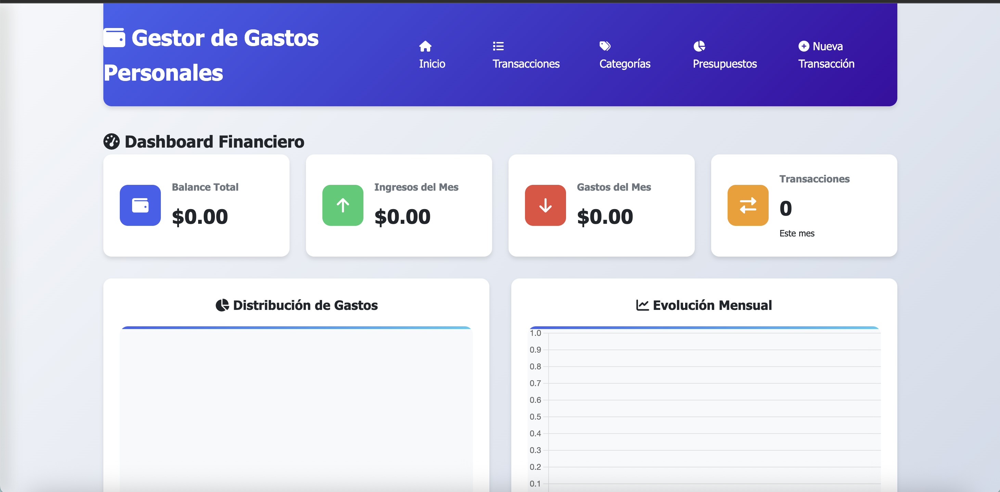
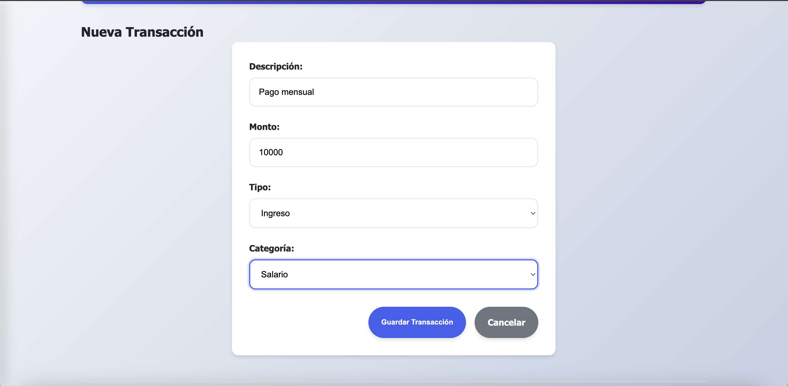
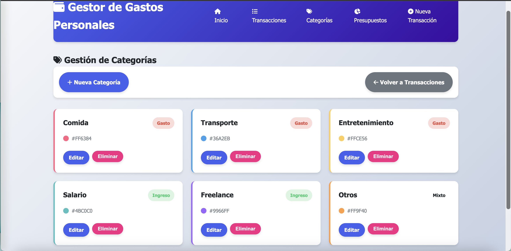
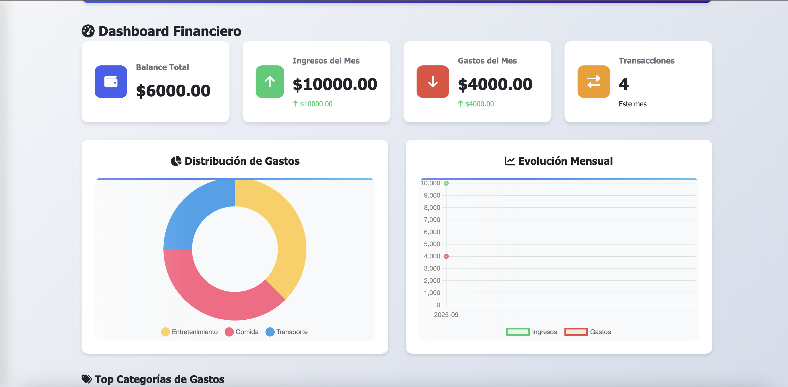
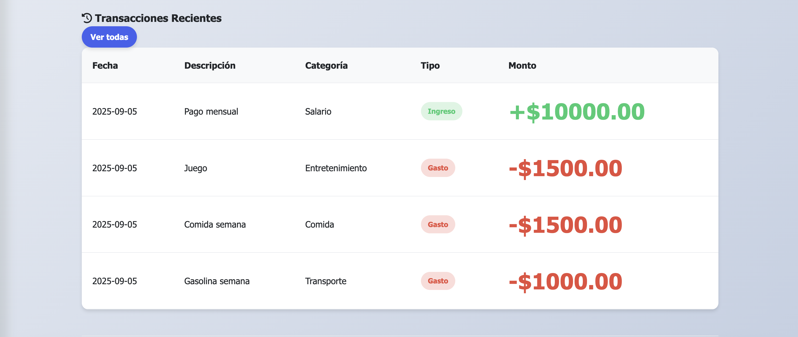
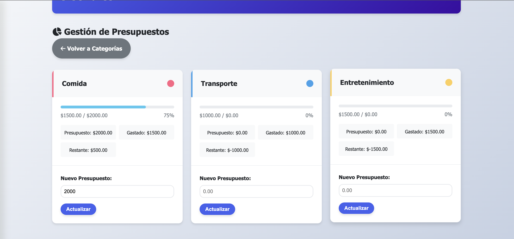
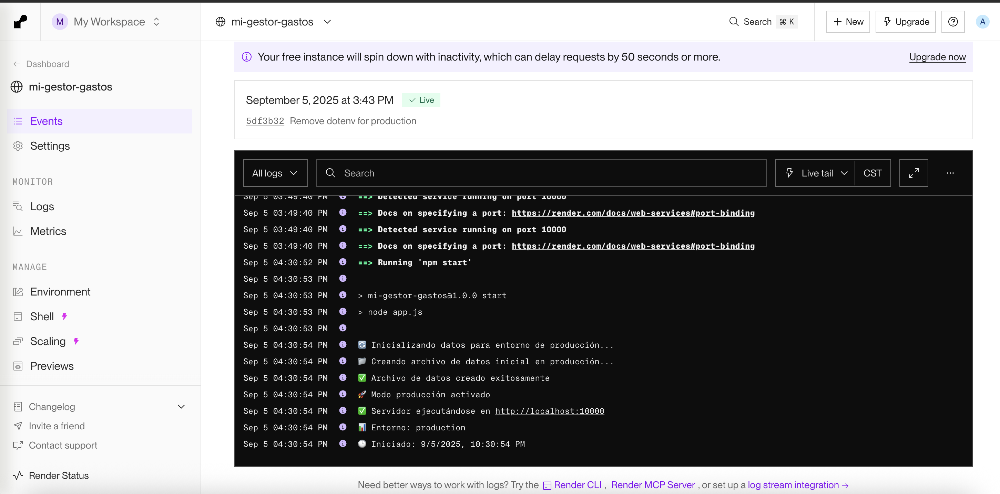

# 📊 Gestor de Gastos Personales

Una aplicación web completa para gestionar finanzas personales, construida con Node.js, Express y EJS, desplegada en Render.

## 🚀 Características

### ✨ Funcionalidades Principales
- **Registro de transacciones** (ingresos y gastos)
- **Sistema de categorías personalizable**
- **Dashboard con gráficos interactivos** (Chart.js)
- **Sistema de presupuestos por categoría**
- **Filtros avanzados y búsqueda**
- **Exportación de datos a CSV**
- **Diseño responsive** (móvil y desktop)
- **Modo claro/oscuro**

### 🛠️ Tecnologías Utilizadas
- **Backend**: Node.js, Express.js
- **Frontend**: EJS, CSS3, JavaScript
- **Base de datos**: JSON con persistencia
- **Gráficos**: Chart.js
- **Iconos**: Font Awesome
- **Deployment**: Render.com
- **Estilos**: CSS custom con variables

## 📸 Capturas de Pantalla

### Dashboard Principal

*Vista principal con métricas, gráficos y resumen financiero*

### Gestión de Transacciones

*Lista de transacciones con filtros y opciones de edición*

### Sistema de Categorías

*Gestión de categorías personalizadas con colores*

### Gráficos Interactivos

*Gráficos de distribución de gastos y evolución mensual*

### Historial de gastos

*Historial de ultimos gastos e ingresos*

### Presupuesto

*Gráficos de distribución de gastos y evolución mensual*

### Despliegue

*Evidencia de despliegue en Render*


## 🎥 Video Demostrativo

[](https://youtu.be/DzNmTdxmnq8)
*Click en la imagen para ver video demostrativo de todas las funcionalidades*

## 📦 Instalación Local

### Prerrequisitos
- Node.js 18+ 
- npm o yarn

### Pasos de instalación
```bash
# Clonar repositorio
git clone https://github.com/BrandonCM18/mi-gestor-gastos.git
cd mi-gestor-gastos

# Instalar dependencias
npm install

# Ejecutar en desarrollo
npm run dev

# Abrir en navegador
http://localhost:3000

# Link Render
https://mi-gestor-gastos.onrender.com/x